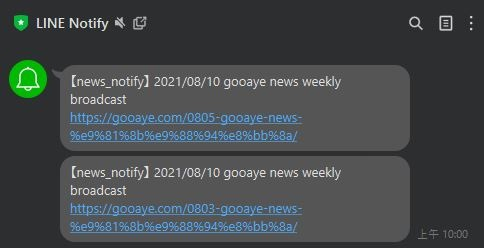

 # Gooayeproject
 
 ## show gooayenews article weekly
 

 ## Data Sources
 - https://gooaye.com/

 ## Getting Started
 
 ### Install Scrapy & Python 3.6.8
 
 **Windows**
 
 ### Run
 ```sh
 $ git clone https://github.com/Bluesss30/Gooaye.git
 web: python run.py
 $ pip install pipenv
 pipenv install
 pipenv run scrapy crawl gooaye
 ```

 ```bat
    ./GooayeNews.bat
 ```
 
 ### Update Schedule
 
 - Weekly @Monday 10:00am
 - Duration: ~ 1 mins
 

 
